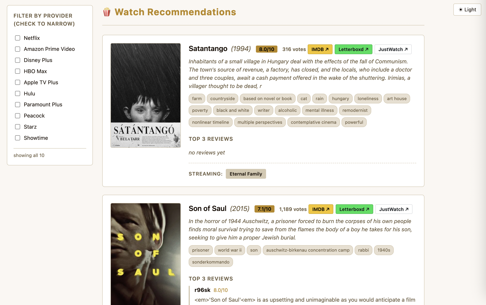

# movie-recs

Recommend movies and TV from a short user description. Stdlib-only Python script
(`movie_recs.py`, ~90 KB) that calls TMDB, Gemini, OMDb, and Wikipedia.



## Where to start

| You are… | Read |
|---|---|
| New user — want to run it | [`docs/quickstart.md`](./docs/quickstart.md) |
| Claude Code agent — invoking the skill | [`SKILL.md`](./SKILL.md) |
| Maintainer — want the full reference | [`SKILL.md`](./SKILL.md) |

## What it does

- Keyword lookup (spy / espionage / assassin / time-travel)
- Recommendations seeded by a film, an actor, or a half-remembered plot
- `--html` for a self-contained `watch_{slug}.html` (posters, streaming providers, reviews)
- Optional NotebookLM memory across sessions

## Example output

A live render is included in [`docs/hungarian-classics.html`](./docs/hungarian-classics.html) — 14 Hungarian films, ranked by Gemini + filtered with `--nationality HU`. Generated by:

```bash
python3 movie_recs.py --plot-query "canonical Hungarian cinema..." --nationality HU \
    --html --out docs/hungarian-classics.html
```

## Requirements

- Python 3.10+ (stdlib only; `diskcache` and `anthropic` are optional)
- API keys: TMDB (required), Gemini (required for `--plot-query`), OMDb (optional), Anthropic (optional)

See [`docs/quickstart.md`](./docs/quickstart.md) for how to obtain and set them up.

## Layout

```
movie_recs.py   the script
SKILL.md        full skill reference (Claude Code integration, NotebookLM, quirks)
LICENSE         MIT
tmdb-api.json   TMDB OpenAPI 3.1 spec (bundled, no secrets)
notebooks.json  UUIDs of the two NotebookLM notebooks (recs + plots)
docs/
  quickstart.md         1-page setup + first runs
  movie_recs_html.png   example HTML output (shown above)
  hungarian-classics.html live render from a --plot-query --nationality HU run
```

## License

[MIT](./LICENSE) — Copyright (c) 2026 riverolfe.